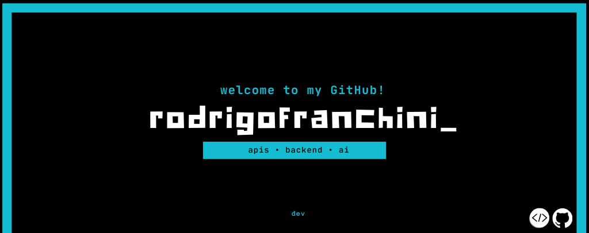

---
### Professional link 🔗

### My Main Tech Stack 📱

 
    
    
    
    
    

### Sobre mim:
> "I am a Software Engineering student at PUC Minas, dedicated to technology and the pursuit of new challenges."
---

